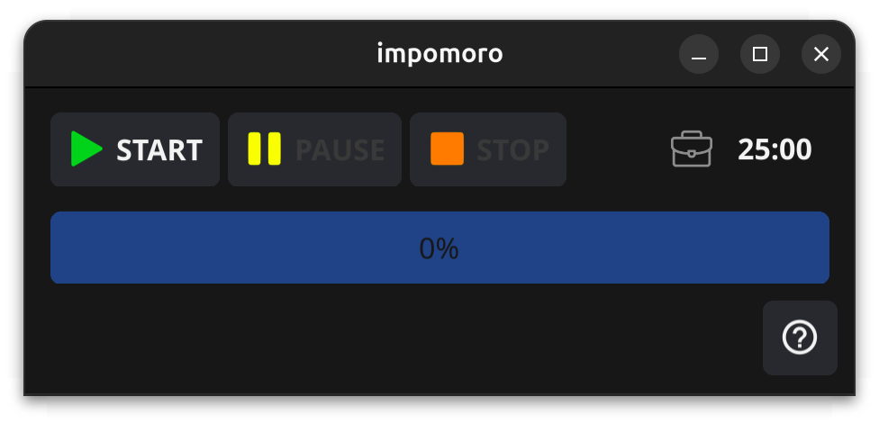

<p align="center">
  
</p>

**impomoro** is a simple cross-platform pomodoro timer written in Go with [fyne](https://fyne.io/) as a GUI framework.

<p align="center">
  
</p>

## Why impomoro?

Initially, it was planned to use the [ImGui](https://github.com/ocornut/imgui) framework for the GUI. That's how the name turned out — **Im**Gui + **pomo**do**ro**. Then a different framework was chosen, but the name remained.

## Main features

* Provides two configurable ranges of work and rest timers.
* Displays system notifications at the end of each of the timers.
* Supports the system tray as an experimental feature.

## Installation

Download the package from the [releases](https://github.com/Zhbert/impomoro/releases) section and install it according to your OS.

The utility is built for the following operating systems:
* Linux
* macOS
* FreeBSD
* Windows

## Configuration

The configuration is stored in a YAML configuration file located in the user's home directory in the `.impomoro` directory. For example, in Linux systems it will be `~/.impomoro`.

The first time you run it, a configuration file with default settings is created in the directory. Also, an icon file is generated next to it, which is used to display system notifications.

### Configuration file

The configuration file is called `config.yml`:
```yaml
# Window settings
display:
    width: 400
    height: 100
# Period length settings in minutes
time:
    longTime: 25
    shortTime: 5
# System settings
system:
    # Turns on the system tray
    enableTray: false
```

### System tray

Turn the `enableTray` parameter of the configuration file to `true` to enable the system tray.

> **Attention!** In some environments, it may work uncorrectly. For example, in Gnome.

When the tray is turned on, the close window button will minimize it to the tray, and not close the application.

## License

MIT License, see [LICENSE](https://github.com/Zhbert/impomoro/blob/main/LICENSE).
